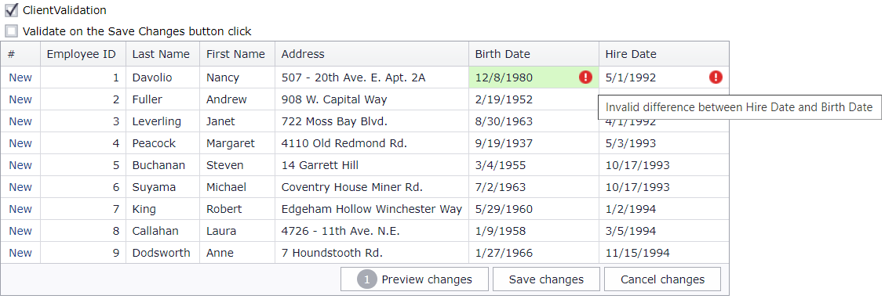

<!-- default badges list -->

[](https://supportcenter.devexpress.com/ticket/details/T171182)
[](https://docs.devexpress.com/GeneralInformation/403183)
<!-- default badges end -->
# Grid View for ASP.NET Web Forms - How to implement custom date validation in batch edit mode
<!-- run online -->
**[[Run Online]](https://codecentral.devexpress.com/t171182/)**
<!-- run online end -->

This example demonstrates how to validate date column values on the client and server when the grid is in batch edit mode.



## Overview

Follow the steps below:

1. On the client side, handle the grid's [BatchEditRowValidating](https://docs.devexpress.com/AspNet/js-ASPxClientGridView.BatchEditRowValidating) event. In a handler, use the [validationInfo](https://docs.devexpress.devx/AspNet/js-ASPxClientGridViewBatchEditRowValidatingEventArgs.validationInfo) argument property to get information about the modified row and call the `CheckYears` function to calculate the difference between the values of particular cells. Based on the calculated number, define whether the entered data is valid and specify an error text string for invalid data cells.

    ```aspx
    <dx:ASPxGridView ID="ASPxGridView1" ClientInstanceName="grid" runat="server" KeyFieldName="EmployeeID">
        <SettingsEditing Mode="Batch" />
        <!-- ... -->
        <ClientSideEvents BatchEditRowValidating="OnValidation" />
    </dx:ASPxGridView>
    ```

    ```js
    function OnValidation(s, e) {
        // ...
        var grid = ASPxClientGridView.Cast(s);
        var cellInfo1 = e.validationInfo[grid.GetColumnByField("BirthDate").index];
        var cellInfo2 = e.validationInfo[grid.GetColumnByField("HireDate").index];
        var years = CheckYears(cellInfo1.value, cellInfo2.value);
        if (years == null || years < 18) {
            cellInfo1.isValid = false;
            cellInfo2.isValid = false;
            cellInfo2.errorText = "Invalid difference between Hire Date and Birth Date";
            cellInfo1.errorText = "Invalid difference between Hire Date and Birth Date";
        } else {
            cellInfo1.isValid = true;
            cellInfo2.isValid = true;
        }
    }
    function CheckYears(date1, date2) {
        if (!date1 || !date2)
            return null;
        var msecPerYear = 1000 * 60 * 60 * 24 * 365;
        var years = (date2.getTime() - date1.getTime()) / msecPerYear;
        return years;
    }
    ```

2. On the server side, handle the grid's [RowValidating](https://docs.devexpress.com/AspNet/DevExpress.Web.ASPxGridView.RowValidating) event. In a handler, use the [NewValues](https://docs.devexpress.devx/AspNet/DevExpress.Web.ASPxGridDataValidationEventArgs.NewValues) argument property to get the new values of modified cells and call the `CheckYears` function to get the result of date calculation. Use the [Errors](https://docs.devexpress.devx/AspNet/DevExpress.Web.Data.ASPxDataValidationEventArgs.Errors) and [RowError](https://docs.devexpress.devx/AspNet/DevExpress.Web.Data.ASPxDataValidationEventArgs.RowError) argument properties to specify error text strings for invalid data cells and the [Error Row](https://docs.devexpress.devx/AspNet/3775/components/grid-view/visual-elements/error-row).

    ```aspx
    <dx:ASPxGridView ID="ASPxGridView1" runat="server" KeyFieldName="EmployeeID"
        OnRowValidating="ASPxGridView1_RowValidating" ...>
        <SettingsEditing Mode="Batch" />
        <!-- ... -->
    </dx:ASPxGridView>
    ```

    ```csharp
    private bool CheckYears(DateTime hireDate, DateTime birthDate) {
        TimeSpan span = hireDate - birthDate;
        if (span.TotalDays / 365 < 18)
            return false;
        else
            return true;
    }

    void AddError(Dictionary<GridViewColumn, string> errors, GridViewColumn column, string errorText) {
        if (errors.ContainsKey(column)) return;
        errors[column] = errorText;
    }

    protected void ASPxGridView1_RowValidating(object sender, DevExpress.Web.Data.ASPxDataValidationEventArgs e) {
        DateTime birthDate = (DateTime)e.NewValues["BirthDate"];
        DateTime hireDate = (DateTime)e.NewValues["HireDate"];
        var result = CheckYears(hireDate, birthDate);
        if (!result) {
            AddError(e.Errors, ASPxGridView1.Columns["BirthDate"], "Invalid difference between Hire Date and Birth Date");
            AddError(e.Errors, ASPxGridView1.Columns["HireDate"], "Invalid difference between Hire Date and Birth Date");
            e.RowError = "Correct validation errors";
        }
        // ...
    }
    ```

3. Use the grid's [AllowValidationOnEndEdit](https://docs.devexpress.com/AspNet/DevExpress.Web.GridBatchEditSettings.AllowValidationOnEndEdit) property to specify whether to validate data when a cell switches from edit to browse mode or on the **Save changes** button click.

    ```aspx
    <dx:ASPxCheckBox runat="server" ID="ASPxCheckBox2" AutoPostBack="true" Checked="false"
        Text="Validate on the Save Changes button click" OnCheckedChanged="ASPxCheckBox2_CheckedChanged" />
    ```

    ```csharp
    protected void ASPxCheckBox2_CheckedChanged(object sender, EventArgs e) {
        ASPxGridView1.SettingsEditing.BatchEditSettings.AllowValidationOnEndEdit = !ASPxCheckBox2.Checked;
    }
    ```

## Files to Review

* [Default.aspx](./CS/WebSite/Default.aspx) (VB: [Default.aspx](./VB/WebSite/Default.aspx))
* [Default.aspx.cs](./CS/WebSite/Default.aspx.cs) (VB: [Default.aspx.vb](./VB/WebSite/Default.aspx.vb))

## Documentation

* [Grid in Batch Edit Mode]()
* [Validate Data in Grid]()
* [BatchEditRowValidating]()
* [RowValidating]()

## More Examples

* [GridView for ASP.NET Web Forms - How to validate duplicate values in batch edit mode](https://github.com/DevExpress-Examples/asp-net-web-forms-grid-validate-duplicate-values-in-batch-edit-mode)
